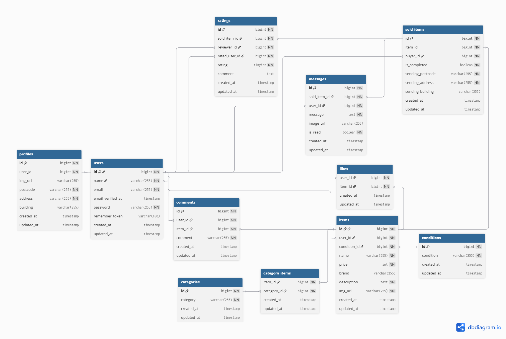

# 環境構築

1. Dockerを起動する

2. プロジェクト直下で、以下のコマンドを実行する

```
make init
```

※Makefileは実行するコマンドを省略することができる便利な設定ファイルです。コマンドの入力を効率的に行えるようになります。<br>

## メール認証
maihogというツールを使用しています。<br>
以下のリンクから会員登録をしてください。　<br>
https://mailtrap.io/

メールボックスのIntegrationsから 「laravel 7.x and 8.x」を選択し、　<br>
.envファイルのMAIL_MAILERからMAIL_ENCRYPTIONまでの項目をコピー＆ペーストしてください。　<br>
MAIL_FROM_ADDRESSは任意のメールアドレスを入力してください。　

## Stripeについて
コンビニ支払いとカード支払いのオプションがありますが、決済画面にてコンビニ支払いを選択しますと、レシートを印刷する画面に遷移します。そのため、カード支払いを成功させた場合に意図する画面遷移が行える想定です。<br>

また、StripeのAPIキーは以下のように設定をお願いいたします。
```
STRIPE_PUBLIC_KEY="パブリックキー"
STRIPE_SECRET_KEY="シークレットキー"
```

以下のリンクは公式ドキュメントです。<br>
https://docs.stripe.com/payments/checkout?locale=ja-JP
## テーブル仕様
### usersテーブル
| カラム名 | 型 | primary key | unique key | not null | foreign key |
| --- | --- | --- | --- | --- | --- |
| id | bigint | ◯ |  | ◯ |  |
| name | varchar(255) |  |  | ◯ |  |
| email | varchar(255) |  | ◯ | ◯ |  |
| email_verified_at | timestamp |  |  |  |  |
| password | varchar(255) |  |  | ◯ |  |
| remember_token | varchar(100) |  |  |  |  |
| created_at | timestamp |  |  |  |  |
| updated_at | timestamp |  |  |  |  |

### profilesテーブル
| カラム名 | 型 | primary key | unique key | not null | foreign key |
| --- | --- | --- | --- | --- | --- |
| id | bigint | ◯ |  | ◯ |  |
| user_id | bigint |  |  | ◯ | users(id) |
| img_url | varchar(255) |  |  |  |  |
| postcode | varchar(255) |  |  | ◯ |  |
| address | varchar(255) |  |  | ◯ |  |
| building | varchar(255) |  |  |  |  |
| created_at | timestamp |  |  |  |  |
| updated_at | timestamp |  |  |  |  |

### itemsテーブル
| カラム名 | 型 | primary key | unique key | not null | foreign key |
| --- | --- | --- | --- | --- | --- |
| id | bigint | ◯ |  | ◯ |  |
| user_id | bigint |  |  | ◯ | users(id) |
| condition_id | bigint |  |  | ◯ | condtions(id) |
| name | varchar(255) |  |  | ◯ |  |
| price | int |  |  | ◯ |  |
| brand | varchar(255) |  |  |  |  |
| description | varchar(255) |  |  | ◯ |  |
| img_url | varchar(255) |  |  | ◯ |  |
| created_at | timestamp |  |  |  |  |
| updated_at | timestamp |  |  |  |  |

### commentsテーブル
| カラム名 | 型 | primary key | unique key | not null | foreign key |
| --- | --- | --- | --- | --- | --- |
| id | bigint | ◯ |  | ◯ |  |
| user_id | bigint |  |  | ◯ | users(id) |
| item_id | bigint |  |  | ◯ | items(id) |
| comment | varchar(255) |  |  | ◯ |  |
| created_at | timestamp |  |  |  |  |
| updated_at | timestamp |  |  |  |  |

### likesテーブル
| カラム名 | 型 | primary key | unique key | not null | foreign key |
| --- | --- | --- | --- | --- | --- |
| user_id | bigint |  | ◯(item_idとの組み合わせ) | ◯ | users(id) |
| item_id | bigint |  | ◯(user_idとの組み合わせ) | ◯ | items(id) |
| created_at | timestamp |  |  |  |  |
| updated_at | timestamp |  |  |  |  |

### sold_itemsテーブル
| カラム名 | 型 | primary key | unique key | not null | foreign key |
| --- | --- | --- | --- | --- | --- |
| user_id | bigint |  |  | ◯ | users(id) |
| item_id | bigint |  |  | ◯ | items(id) |
| sending_postcode | varchar(255) |  |  | ◯ |  |
| sending_address | varchar(255) |  |  | ◯ |  |
| sending_building | varchar(255) |  |  |  |  |
| created_at | created_at |  |  |  |  |
| updated_at | updated_at |  |  |  |  |

### category_itemsテーブル
| カラム名 | 型 | primary key | unique key | not null | foreign key |
| --- | --- | --- | --- | --- | --- |
| item_id | bigint |  | ◯(category_idとの組み合わせ) | ◯ | items(id) |
| category_id | bigint |  | ◯(item_idとの組み合わせ) | ◯ | categories(id) |
| created_at | timestamp |  |  |  |  |
| updated_at | timestamp |  |  |  |  |

### categoriesテーブル
| カラム名 | 型 | primary key | unique key | not null | foreign key |
| --- | --- | --- | --- | --- | --- |
| id | bigint | ◯ |  | ◯ |  |
| category | varchar(255) |  |  | ◯ |  |
| created_at | timestamp |  |  |  |  |
| updated_at | timestamp |  |  |  |  |

### conditionsテーブル
| カラム名 | 型 | primary key | unique key | not null | foreign key |
| --- | --- | --- | --- | --- | --- |
| id | bigint | ◯ |  | ◯ |  |
| condition | varchar(255) |  |  | ◯ |  |
| created_at | timestamp |  |  |  |  |
| updated_at | timestamp |  |  |  |  |

## ER図


## テストアカウント
以下は Seeder に基づくテストユーザーのログイン情報です。  
ログイン後、それぞれのユーザーで出品状況を確認できます。
---
**ユーザーA（出品者）**  
- name: ユーザーA（出品者）  
- email: seller_a@example.com  
- password: password  
　（CO01～CO05の商品データを出品）
---
**ユーザーB（出品者）**  
- name: ユーザーB（出品者）  
- email: seller_b@example.com  
- password: password  
    （CO01～CO05の商品データを出品）
---
**ユーザーC（未紐づけユーザー）**  
- name: ユーザーC（未紐づけ）  
- email: user_c@example.com  
- password: password  
    （取引・出品に紐づいていないテストユーザーです）
---

## PHPUnitを利用したテストに関して
以下のコマンド:  
```
//テスト用データベースの作成
docker-compose exec mysql bash
mysql -u root -p
//パスワードはrootと入力
create database test_database;

docker-compose exec php bash
php artisan migrate:fresh --env=testing
./vendor/bin/phpunit
```
※.env.testingにもStripeのAPIキーを設定してください。  

